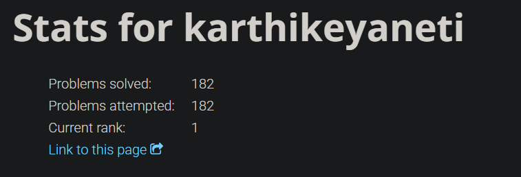

# HDLBits Verilog Solutions


💡 My solutions to the Verilog-based problem set on [HDLBits](https://hdlbits.01xz.net/wiki/Problem_sets) — **182 problems** covering **combinational**, **sequential**, and **FSM-based** digital design.



---

## 📌 About HDLBits

[HDLBits](https://hdlbits.01xz.net/) is an interactive platform developed by Henry Wong at University of Toronto to help students and engineers master **Verilog HDL** through progressively challenging problems. It focuses on:

- ✅ Syntax and simulation basics
- ✅ Combinational and sequential logic design
- ✅ Finite State Machines (Mealy & Moore)
- ✅ Common design patterns like shift registers and counters
- ✅ Debugging and waveform analysis

All problems encourage correct **synthesizable Verilog** practices.

---

## 🚀 My Progress

🟢 **Completed all 182 problems!**  

<table>
  <tr width="100%">
    <td align="center" valign="center">
      <table>
        <tr><td>Getting Started</td><td>✅ Done</td></tr>
        <tr><td>Verilog Language</td><td>✅ Done</td></tr>
        <tr><td>Circuits</td><td>✅ Done</td></tr>
        <tr><td>Verification - Reading Simulations</td><td>✅ Done</td></tr>
        <tr><td>Verification - Writing Testbenches</td><td>✅ Done</td></tr>
        <tr><td>CS450</td><td>✅ Done</td></tr>
      </table>
    </td>
    <td align="center" valign="center" width="45%">
      
    </td>
  </tr>
</table>

---

## 🗂️ Folder Structure

```
HDLBits_Solutions/
├── 0. Getting Started/
├── 1. Verilog Language/
│   ├── 1 - Basics/
│   ├── 2 - Vectors/
│   ├── 3 - Modules Hierarchy/
│   ├── 4 - Procedures/
│   └── 5 - More Verilog Features/
├── 2. Circuits/
│   ├── 1 - Combinational Logic/
│   ├── 2 - Sequential Logic/
│   └── 3 - Building Larger Circuits/
├── 3. Verification - Reading Simulations/
│   ├── 1 - Finding bugs in code/
│   └── 2 - Build a circuit from a simulation waveform/
├── 4. Verification - Writing Testbenches/
└── 5. CS450/
```

Special thanks to my friend **[andbhavyaa](https://github.com/andbhavyaa)** for creating **[⚡︎ skeldir](https://www.npmjs.com/package/skeldir)** — a command-line tool that automatically generates folder skeletons (directory + file structures) based on text templates.

By combining **ChatGPT** to generate the structured folder layout and **skeldir** to create it instantly on my file system, I was able to set up all problem folders and files without any manual effort.

⚡ The entire process was **hassle-free** and saved lots of repetitive work!

> If you're working on projects that require bulk folder or file setup, I highly recommend checking it out.

---

## 🤝 Contribution

If you have any ideas, just [*open an issue*](https://github.com/karthikeyaneti/HDLBits_Solutions/issues/new) and tell me what you think!

Whether it's improving solutions, adding new waveform visualizations, fixing typos, or enhancing the documentation — every bit helps!

